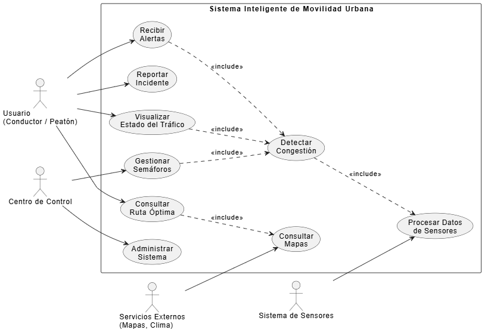
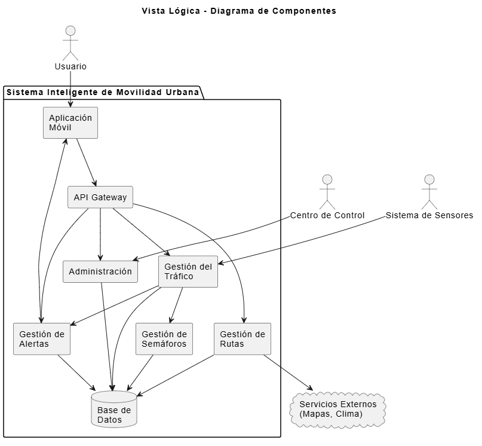
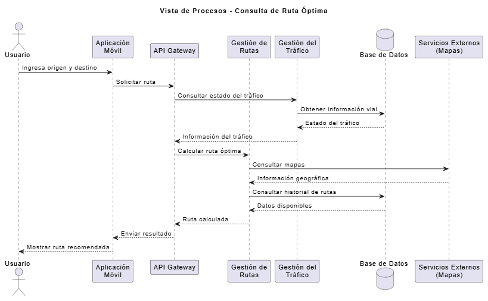
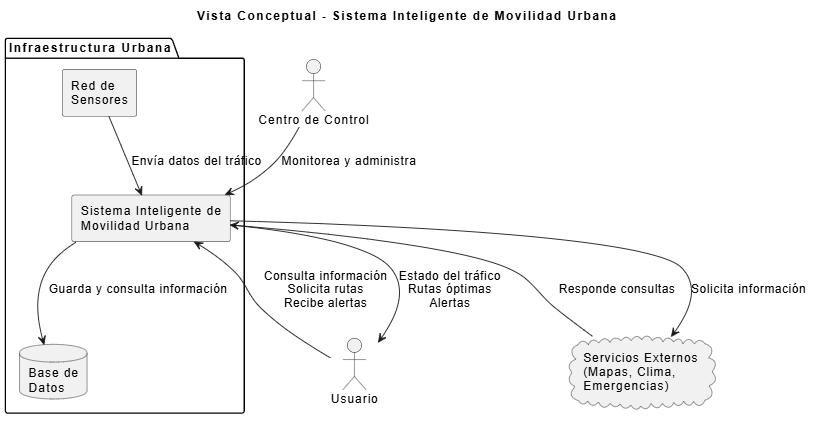

# Fase 3. Construcción de las Vistas Arquitectónicas

Las vistas arquitectónicas permiten representar el sistema desde diferentes perspectivas, facilitando la comprensión de su funcionamiento, la interacción entre sus componentes y la forma en que se distribuyen las responsabilidades dentro de la solución.

---

# 1. Vista de Casos de Uso

## Objetivo

La vista de casos de uso describe las principales funcionalidades del sistema y la forma en que los diferentes actores interactúan con ellas. Esta representación permite identificar claramente los servicios que ofrece la plataforma y quién hace uso de cada uno.

## Diagrama



Usuario([Usuario])
Administrador([Centro de Control])
Sensores([Sensores Urbanos])
Mapas([Servicios Externos])

UC1((Consultar ruta))
UC2((Visualizar tráfico))
UC3((Recibir alertas))
UC4((Reportar incidente))
UC5((Gestionar semáforos))
UC6((Procesar datos))
UC7((Administrar sistema))

Usuario --> UC1
Usuario --> UC2
Usuario --> UC3
Usuario --> UC4

Sensores --> UC6
UC6 --> UC2
UC6 --> UC5

Administrador --> UC5
Administrador --> UC7

Mapas --> UC1
```

## Explicación

Esta vista evidencia la interacción entre los actores y las funcionalidades principales del sistema. Los usuarios pueden consultar rutas, visualizar el estado del tráfico, reportar incidentes y recibir notificaciones. Los sensores suministran información que posteriormente es procesada por la plataforma para actualizar el estado de las vías y apoyar la gestión de los semáforos. El centro de control administra el funcionamiento del sistema y supervisa las operaciones críticas.

---

# 2. Vista Lógica

## Objetivo

La vista lógica representa la organización interna de la solución, mostrando cómo se distribuyen los módulos de software y las relaciones existentes entre ellos para cumplir con los requisitos del sistema.

## Diagrama



APP[Aplicación Móvil]

TRAFICO[Gestión del Tráfico]
RUTAS[Gestión de Rutas]
SEMAFOROS[Gestión de Semáforos]
SENSORES[Gestión de Sensores]
ALERTAS[Gestión de Alertas]
ADMIN[Administración]

API[API Gateway]

BD[(Base de Datos)]

EXT[Servicios Externos]

APP --> API

API --> TRAFICO
API --> RUTAS
API --> ALERTAS

SENSORES --> TRAFICO

TRAFICO --> SEMAFOROS
TRAFICO --> RUTAS
TRAFICO --> ALERTAS

RUTAS --> EXT

TRAFICO --> BD
SEMAFOROS --> BD
RUTAS --> BD
ALERTAS --> BD
ADMIN --> BD
```

## Componentes principales

- Aplicación móvil.
- API Gateway.
- Gestión del tráfico.
- Gestión de rutas.
- Gestión de semáforos.
- Gestión de sensores.
- Gestión de alertas.
- Administración.
- Base de datos.
- Servicios externos.

## Explicación

Cada módulo desarrolla una responsabilidad específica dentro del sistema. La aplicación móvil envía las solicitudes mediante una API, la cual distribuye las peticiones hacia los servicios correspondientes. Posteriormente, los datos procesados son almacenados en la base de datos y complementados con información proveniente de servicios externos para ofrecer respuestas más precisas.

---

# 3. Vista de Procesos

## Objetivo

La vista de procesos describe la secuencia de actividades que se ejecutan cuando un usuario solicita una ruta hacia un destino determinado.

## Escenario

Consulta de una ruta óptima considerando el estado actual del tráfico.

## Diagrama



actor Usuario

participant App
participant API
participant ServicioRutas
participant ServicioTrafico
participant Mapas

Usuario->>App: Ingresa origen y destino
App->>API: Solicita cálculo de ruta
API->>ServicioRutas: Procesar solicitud
ServicioRutas->>ServicioTrafico: Consultar tráfico
ServicioTrafico-->>ServicioRutas: Estado actualizado

ServicioRutas->>Mapas: Consultar información geográfica
Mapas-->>ServicioRutas: Datos cartográficos

ServicioRutas->>ServicioRutas: Generar mejor recorrido

ServicioRutas-->>API: Resultado
API-->>App: Ruta calculada
App-->>Usuario: Mostrar recorrido recomendado
```

## Participantes

- Usuario.
- Aplicación móvil.
- API Gateway.
- Servicio de rutas.
- Servicio de tráfico.
- Servicio de mapas.

## Explicación

El proceso comienza cuando el usuario solicita una ruta desde la aplicación. La petición es enviada al servidor, donde se consulta el estado del tráfico y la información cartográfica disponible. Con estos datos el sistema calcula el recorrido más conveniente y devuelve la respuesta al usuario, quien recibe la ruta recomendada junto con información actualizada sobre las condiciones del tránsito.

---

# 4. Vista Conceptual

## Objetivo

La vista conceptual presenta una representación general del ecosistema del sistema, identificando los dominios principales y las relaciones existentes entre ellos.

## Diagrama


Usuarios[Usuarios]

Sensores[Sensores Urbanos]

Sistema[Sistema Inteligente de Movilidad]

Servicios[Servicios Externos]

Centro[Centro de Control]

Usuarios --> Sistema
Sensores --> Sistema
Centro --> Sistema
Sistema --> Servicios
Servicios --> Sistema
Sistema --> Usuarios
```

## Explicación

La arquitectura conceptual muestra que el Sistema Inteligente de Movilidad actúa como el núcleo de la solución. La información recopilada por los sensores es procesada internamente para ofrecer servicios tanto a los ciudadanos como al centro de control. Asimismo, el sistema mantiene comunicación permanente con plataformas externas que proporcionan información adicional, como mapas digitales y servicios meteorológicos, enriqueciendo así el proceso de toma de decisiones.